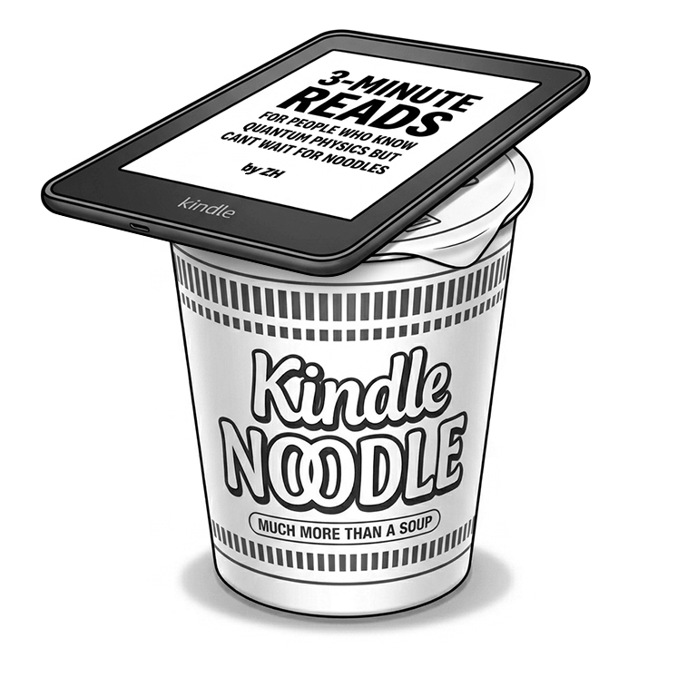
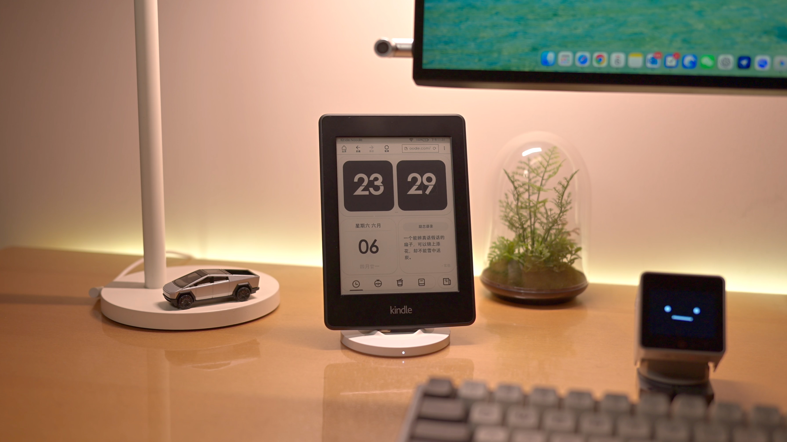

# Kindle Noodle 🍜


**把吃灰的 Kindle 变成你的桌面搭子。**

一个纯 HTML 单文件 Web App，专为 Kindle Paperwhite 的 E-ink 屏幕设计，让闲置的 Kindle 在桌面上重新发光。

🔗 **在线体验**：[kindlenoodle.com](https://kindlenoodle.com)



---

## 📺 视频介绍

📺 [点击观看完整介绍视频（B站）](https://www.bilibili.com/video/BV1fWju6vEZo/?spm_id_from=333.1387.homepage.video_card.click&vd_source=bffaec2ad547755a7de74fb6c41ea36f)

---

## ✨ 功能一览



**🕐 翻页时钟 / 模块时钟**
两种风格可切换，E-ink 屏幕上的复古感拉满。

**🍅 番茄计时**
25 分钟专注倒计时，帮你进入沉下心的状态。

**🍜 盖泡面计时器**
Kindle 终于干回了它的老本行 —— 给泡面盖盖子。

**📖 阅读模式**
一键跳转微信读书，让 Kindle 重新成为阅读工具。

**📰 AI Builders 日报**
追踪真正构建 AI 产品、模型与研究的人，数据与摘要规则来自内置的 `follow-builders` skill。

---

## 📱 如何使用

1. 打开 Kindle 的「体验版浏览器」
2. 在地址栏输入 `kindlenoodle.com`
3. 在 Kindle 搜索栏输入 `~ds` 开启屏幕常亮
4. 放在桌面上，开始享用

也可以在手机或电脑浏览器上直接访问体验。

---

## 🖥 兼容设备

专为 Kindle 的 E-ink 屏幕优化，同时兼容多种分辨率：

| 设备 | 屏幕宽度 | 状态 |
|------|---------|------|
| Kindle Paperwhite 2 | 758px | ✅ 主要适配 |
| Kindle Paperwhite 3/4 | 1072px | ✅ 兼容 |
| Kindle Oasis | 1264px | ✅ 兼容 |
| Kindle 基础版 | 600px | ✅ 兼容 |
| 桌面 / 手机浏览器 | 任意 | ✅ 可用 |

### E-ink 适配细节

- 不使用 CSS `animation` / `transition`（E-ink 不支持）
- 使用线条替代阴影（避免 E-ink 残影）
- 字体最小 28px（适配 E-ink 的高 PPI 显示）
- 支持 `~ds` 快捷键开启常亮模式

---

## 📦 项目结构

```
KindleNoodle/
├── index.html              # 整个 App（单文件架构）
├── data/
│   ├── daily.json          # Kindle 当前展示的 Builder 日报
│   └── archive/            # 历史日报归档
├── ai-builder/             # Follow Builders 源、prompts 与 Kindle 转换器
├── img/                    # 图片资源
├── .github/
│   └── workflows/
│       └── build-ai-builders.yml # 生成并提交 Builder 日报
└── CNAME                   # 自定义域名配置
```

---

## 🔄 AI Builders 日报更新机制

```
ai-builder/scripts/prepare-digest.js
    ↓ 汇总 X、博客与播客原始 feed，并加载 prompts
AI Builder skill
    ↓ 依据 prompts 筛选、总结并翻译
ai-builder/kindle-digest.json
    ↓ node ai-builder/scripts/build-kindle-daily.js
data/daily.json + data/archive/YYYY-MM-DD.json
    ↓ GitHub Pages 部署
Kindle 刷新页面即可看到最新内容
```

> `build-ai-builders.yml` 只负责校验、转换并提交已经生成好的
> `ai-builder/kindle-digest.json`。筛选、总结和翻译必须先由运行
> `follow-builders` 的 AI agent 完成；整个链路不再请求 AI HOT。

本地生成 Kindle 数据：

```bash
node ai-builder/scripts/build-kindle-daily.js
```

---

## 🛠 技术栈

- **前端**：纯 HTML + CSS + JavaScript（单文件，无框架依赖）
- **设计**：Figma → Figma MCP → Claude Code
- **部署**：GitHub Pages + Cloudflare（DNS + Analytics）
- **自动化**：GitHub Actions + cron-job.org
- **数据源**：内置 [Follow Builders](https://github.com/zarazhangrui/follow-builders) skill（X、博客、播客）

## 🚀 GitHub Pages

推送到 `main` 分支后，`deploy-pages.yml` 会自动发布整个静态站点。项目仓库
为 `Esther1228/kindle-app` 时，默认访问地址为：

```text
https://esther1228.github.io/kindle-app/
```

---

## 🏗 开发方式

这个项目完全通过 **Vibe Coding** 构建 —— 设计稿在 Figma 中完成，通过 Figma MCP 让 Claude Code 直接读取设计稿并生成代码，再手动微调细节和硬件适配。

AI 完成了大约 60-70% 的初稿工作，剩下的 30-40%（品味判断、文化语境、E-ink 硬件适配）是 AI 无法替代的人工打磨。

---

## 📊 隐私说明

本项目使用 Cloudflare Web Analytics 收集匿名访问统计数据。该服务不使用 Cookie，不收集任何个人身份信息，符合 GDPR 规范。

---

## 📄 License

MIT

---

## 🙋 关于作者

**正号ZH**

外企产品设计师 | 对世界保持好奇，正在积极拥抱AI～
